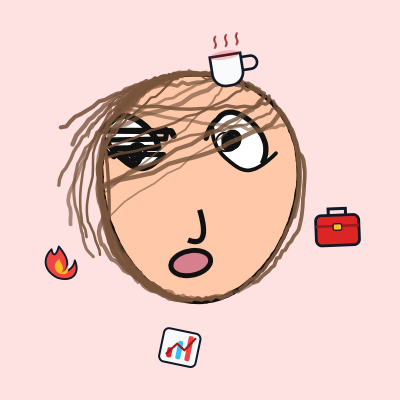
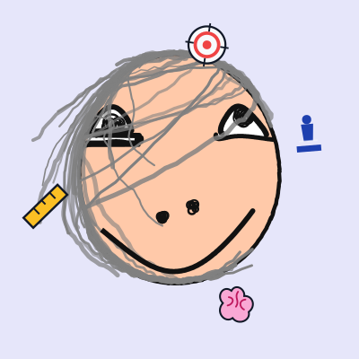
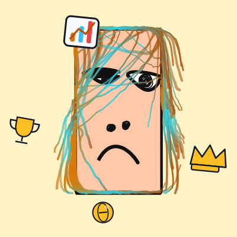

<p align="center">
  
  
  
  
  
</p>

<h1 align="center">
  NBTI · 牛比体
  <br/>
  <sub>Your Workplace DNA, Roasted by AI</sub>
  <br/>
  <sub>专治各种职场不服</sub>
</h1>

<p align="center">
  <i>Not another MBTI clone. This one has attitude.</i>
  <br/>
  <i>不是又一个 MBTI 山寨。这个有脾气。</i>
</p>

---

> **EN** — NBTI is an AI-powered workplace personality test that hooks you up with one of 16 hilariously accurate archetypes — from "Workaholic King" to "Workplace Air". Powered by real LLMs (Doubao, DeepSeek, LM Studio, LongCat), it asks improv scenarios, tracks your vibes across 4 dimensions, and delivers a roast so personal you'll wonder if it read your Slack DMs.

> **CN** — NBTI 是 AI 驱动的职场人格测试。连接真实大模型（豆包、DeepSeek、LM Studio、LongCat），用场景化灵魂拷问评估你 4 个维度的行为倾向，给出 16 种人格中属于你的那一个——从「卷王」到「职场空气」，毒舌程度让你怀疑它偷看了你的钉钉。

---

## The Flex / 为什么牛逼

<table>
<tr>
<td width="50%">

### 🧠 Real AI, Not a Spreadsheet
No hardcoded branching logic. Every question is **improvised by an LLM** based on your previous answers. 3 prompt personas to choose from — Roast Homie, BBC Documentary Narrator, or Gossip Bestie.

### 🔌 Multi-LLM Profiles Engine
Hot-swap between **4 vendors** at runtime. Assign different models to different phases (init/assess/result). Test connectivity with one click. JSON mode per profile.

### ⚡ Streaming + Preloading Pipeline
SSE streaming renders responses in real-time. While you're staring at a question, the next one is **already being generated** for all 4 answer branches. Instant transitions.

### 🎨 Procedural Avatar Generator
Each of the 16 types gets a **randomly generated SVG avatar** — unique every time. Procedural face shape, eyes, nose, mouth, hair, and accessories. No images, no assets. Pure math. Every refresh = brand new face.

### 🎁 Personality Accessories
Each type has 4 themed SVG accessories (crown, flame, chessboard, shield, wrench, etc.) auto-placed around the avatar. Ring-positioned, randomly scaled and rotated. Never the same arrangement twice.

### 🛡️ 4-Layer JSON Parsing
LLMs love to wrap JSON in markdown blocks, add preambles, or cut off mid-response. Our parser eats all of that for breakfast.

</td>
<td width="50%">

### 🧠 真 AI，不是 Excel
没有硬编码的题目分支。每一道题都是大模型根据你的历史回答**即兴生成的**。3 套提示词人设——暴躁老油条、冷面纪录片、戏精闺蜜——一键切换。

### 🔌 多模型热插拔引擎
运行时在 4 个供应商之间**任意切换**。不同阶段（开场/出题/结果）可分配不同模型。连通性一键测试。JSON 模式独立开关。

### ⚡ 流式渲染 + 预加载流水线
SSE 实时渲染每个字。你还在看题，下一题的 4 个分支答案**已经生成好了**。秒级切题，体验丝滑。

### 🎨 程序化头像生成器
16 种人格每种配一个**随机生成的 SVG 头像**——每次都不一样。程序化脸型、眼睛、鼻子、嘴巴、头发，纯数学运算，零图片素材。每次刷新都是全新面孔。

### 🎁 人格专属配饰
每种人格 4 个主题 SVG 小物件（皇冠、火焰、棋盘、盾牌、扳手等）环绕头像排布。环形定位，随机缩放旋转。每次排列都不重样。

### 🛡️ 四层 JSON 解析兜底
大模型喜欢给 JSON 套 markdown 代码块、加前缀废话、或者中途截断。我们的解析器四层递进，吃一切吐一切。

</td>
</tr>
</table>

## 16 Personalities / 16 种人格

| Code | Name | EN Tagline | CN Tagline |
|------|------|------------|------------|
| NBTI | 卷王 🔥 | I'm not working late, I'm cultivating | 我不是在加班，我是在修行 |
| NBTP | 棋手 🧠 | The only human on the chessboard | 棋盘上就我一个活人 |
| NBFI | 独狼 ⚡ | One person, one department | 一个人干翻一个部门 |
| NBFP | 浪子 🌊 | CV reads like an adventure novel | 简历像一部冒险小说 |
| NHTI | 霸总 👑 | I'm not gaslighting you | 我不是在 PUA 你 |
| NHTP | 教练 🌟 | I build heroes | 我培养英雄 |
| NHFI | 护犊子 🛡️ | I'll hold up the sky for the team | 天塌了我顶着 |
| NHFP | 气氛组 🌈 | This company would collapse without me | 公司没我早散了 |
| SBTI | 工蚁 🔧 | I keep all the lights on | 我让所有灯都亮着 |
| SBTP | 人形计算器 📐 | Emotions compromise judgment | 感情会影响判断 |
| SBFI | 螺丝钉 ⚙️ | Most boring, most irreplaceable | 最无聊但最不可替代 |
| SBFP | 扫地僧 📚 | You think I'm a noob | 你以为我是青铜 |
| SHTI | 大管家 🏛️ | Zhuge Liang meets project management | 诸葛亮都没我会排 |
| SHTP | 质检警察 📊 | 99.9% not enough. Need 100% | 99.9% 不行，要 100% |
| SHFI | 居委会大妈 🤝 | Conflict? Come to me | 有矛盾找我 |
| SHFP | 职场空气 ☁️ | Going with the flow... and the paycheck | 随缘随风随工资条 |

> Plus 20+ hidden easter egg types — Schrödinger's Employee, Hexagon Warrior, Workplace Buddha, Two-Face, and more.

## AI-Generated Avatars / AI 生成头像

Each personality type gets a **procedurally generated, one-of-a-kind SVG avatar** — no two are ever the same. Every result page is a visual surprise.

每种人格匹配一个**程序化生成的独一无二 SVG 头像**——没有两个是一样的。每次结果页都是视觉惊喜。

<p align="center">
  
  
  
  
  
  
</p>

<p align="center">
  <i>卷王 · 棋手 · 霸总 · 气氛组 · 工蚁 · 扫地僧</i>
  <br/>
  <i>Each with unique colors, accessories, and face generation. <b>Hit refresh — it changes.</b></i>
  <br/>
  <i>每种都有专属配色、配饰和脸型生成。 <b>刷新页面——头像变了。</b></i>
</p>

### What's Under the Hood / 怎么做到的

| Feature | Description |
|---------|-------------|
| Face Shape | Procedural egg/rect contour with randomized control points. Every face is a unique organic shape. |
| Eyes | Cubic Bezier upper/lower lids with pupil scatter. Asymmetric left/right with independent random jitter. |
| Hair | Bezier curve sweeps along the face contour. Multiple generation methods for variety. Rainbow hair or split-color for special types. |
| Nose & Mouth | Randomized nose (dual-dot or single curve) and blob mouth with fuzzy edges. |
| Accessories | 4 themed SVG items per type (crown, flame, chessboard, shield, wrench, etc.). Ring-placed around the avatar with random scale/rotation. |
| Effects | Special types get unique visual effects — golden glow, Buddha light, split face, translucent, danmaku barrage. |
| Theme Color | Each personality has a primary + secondary color palette. Background auto-picks from theme or accent array. |
| Fuzzy Filter | SVG `<feTurbulence>` + `<feDisplacementMap>` gives hand-drawn organic edge feel. |

> **Zero external assets.** No PNGs. No icon fonts. No stock photos. Pure `<svg>` math — 660 lines of JavaScript that runs entirely in the browser.

## Architecture / 架构

```
┌──────────────────────────────────────────────────────┐
│                  Public (IPv4/IPv6)                  │
│  http://[your-ipv6]:8080                             │
└────────────────────────┬─────────────────────────────┘
                         │
┌────────────────────────▼─────────────────────────────┐
│            Frontend Server (:8080)                    │
│  • Static files only (HTML/CSS/JS)                   │
│  • Proxies /api/* → backend                          │
│  • ZERO API keys                                     │
│  • Listens on :: (all interfaces)                    │
└────────────────────────┬─────────────────────────────┘
                         │  API proxy
┌────────────────────────▼─────────────────────────────┐
│            Backend API (:8081)                        │
│  • LLM orchestration                                 │
│  • API keys (never exposed)                          │
│  • Listens on 127.0.0.1 ONLY                         │
│  • Conversation storage                              │
│  • Config management                                 │
└──────────────────────────────────────────────────────┘
```

## Quick Start / 快速开始

```bash
# Install
pip install -r requirements.txt

# Terminal 1: Start backend API (local only, holds API keys)
python server.py

# Terminal 2: Start frontend (public, proxies to backend)
python frontend_server.py 8080

# Open
open http://localhost:8080          # Test
open http://localhost:8080/config.html  # Config
```

## Tech Stack / 技术栈

| Layer | Tech |
|-------|------|
| Frontend | Vanilla HTML/CSS/JS — zero dependencies, full responsive |
| Backend | Python Flask + SSE streaming |
| LLMs | Doubao (Volces Ark) · DeepSeek · LM Studio · LongCat |
| Output | JSON structured + 4-layer parse fallback |
| Avatars | Pure SVG procedural generator — random faces + accessories + effects (660 lines JS) |
| Themes | Dark / Light, auto-detect |

## Key Features Deep Dive / 核心能力

- **LLM Profiles Engine** — Each profile bundles vendor, endpoint, model, API key, temperature, thinking mode, and JSON mode. Mix-and-match per phase.
- **3 Prompt Presets** — 暴躁老油条 (Roast Homie), 冷面纪录片 (BBC Narrator), 戏精闺蜜 (Gossip Bestie). Each with init/assess/result templates.
- **Streaming SSE** — Real-time incremental rendering. Users see every character as it arrives.
- **Preload Pipeline** — Generates next-question drafts for all option branches while user is still reading. Version-protected commit to avoid race conditions.
- **4-Layer JSON Extraction** — Direct parse → markdown block strip → `"phase"`-key regex → bracket matching → legacy tag fallback.
- **Smart Conclusion** — AI decides when dimensions are clear enough (configurable min/max bounds). No fixed question count.
- **SVG Avatar Generator** — 660-line pure JS IIFE. Procedural face shapes (egg/rect with randomized control points), asymmetric cubic Bezier eyes, parametric hair sweeps, and 4 themed accessories per type ring-positioned with random scale/rotation. Fuzzy SVG filter for organic hand-drawn feel. Zero external assets — 100% math.
- **Hidden Special Types** — Schrödinger's Employee (translucent effect), Hexagon Warrior (golden glow), Workplace Buddha (buddha light), Two-Face (split-color), Meme Lord (danmaku barrage).
- **Security** — API keys live only in backend (127.0.0.1). Frontend has zero secrets. IPv6-ready.
- **Config Admin Panel** — Full CRUD for profiles, presets, game params. Test connections live.

## Development / 开发

```bash
# Run tests
pytest tests/ -v

# Lint (if you're into that)
# No framework lock-in — plain everything ✌️
```

## License

MIT — Go wild. Build on it. Ship it.

---

<p align="center">
  <b>NBTI · 牛比体</b><br/>
  <sub>Your personality. Roasted.</sub><br/>
  <sub>你的人格，被 AI 毒舌了。</sub>
</p>
