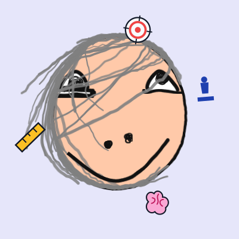
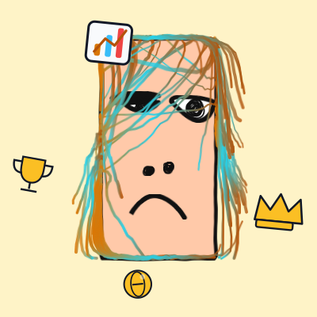
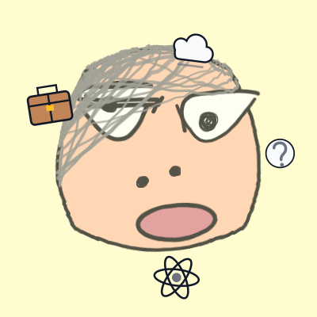

<p align="center">
  
  
  
  
  
  
  
  
</p>

<h1 align="center">
  NBTI · 牛比体
  <br/>
  <sub>Your Workplace DNA, Roasted by AI</sub>
  <br/>
  <sub>专治各种职场不服</sub>
</h1>

<p align="center">
  <i>Not another MBTI clone. This one has attitude.</i>
  <br/>
  <i>不是又一个 MBTI 山寨。这个有脾气。</i>
</p>

<p align="center">
  <a href="#quick-start--快速开始">Quick Start</a> ·
  <a href="#16-personalities--16-种人格">16 Personalities</a> ·
  <a href="#architecture--架构">Architecture</a> ·
  <a href="#configuration">Configuration</a> ·
  <a href="#development">Development</a> ·
  <a href="#contributing">Contributing</a> ·
  <a href="#license">License</a>
</p>

---

> **EN** — NBTI is an AI-powered workplace personality test that hooks you up with one of 16 hilariously accurate archetypes — from "Workaholic King" to "Workplace Air". Powered by real LLMs (Doubao, DeepSeek, LM Studio, LongCat), it asks improv scenarios, tracks your vibes across 4 dimensions, and delivers a roast so personal you'll wonder if it read your Slack DMs.

> **CN** — NBTI 是 AI 驱动的职场人格测试。连接真实大模型（豆包、DeepSeek、LM Studio、LongCat），用场景化灵魂拷问评估你 4 个维度的行为倾向，给出 16 种人格中属于你的那一个——从「卷王」到「职场空气」，毒舌程度让你怀疑它偷看了你的钉钉。

---

## Quick Start / 快速开始

### Docker (Recommended / 推荐)

```bash
git clone https://github.com/Gary23333/NBTI.git
cd NBTI

# 复制配置模板，填入你的 API Key
cp data/config.json.example data/config.json
# 编辑 data/config.json

# 一键启动
docker-compose up -d

# 打开浏览器
open http://localhost:8080
```

### Manual / 手动启动

```bash
git clone https://github.com/Gary23333/NBTI.git
cd NBTI
pip install -r requirements.txt

# 复制配置模板，填入你的 API Key
cp data/config.json.example data/config.json
# 编辑 data/config.json

# 终端 1：启动后端 API（仅本地，持有 API 密钥）
python server.py

# 终端 2：启动前端代理（公网可访问）
python frontend_server.py 8080

# 打开浏览器
open http://localhost:8080          # 测试页
open http://localhost:8080/config.html  # 配置管理页
```

### Production / 生产部署

```bash
# 使用 Gunicorn（已在 requirements.txt 中）
gunicorn -c gunicorn.conf.py server:app

# 或直接 Docker
docker-compose up -d
```

---

## The Flex / 为什么牛逼

<table>
<tr>
<td width="50%">

### Real AI, Not a Spreadsheet
No hardcoded branching logic. Every question is **improvised by an LLM** based on your previous answers. 3 prompt personas to choose from — Roast Homie, BBC Documentary Narrator, or Gossip Bestie.

### Multi-LLM Profiles Engine
Hot-swap between **4 vendors** at runtime. Assign different models to different phases (init/assess/result). Test connectivity with one click. JSON mode per profile.

### Streaming + Preloading Pipeline
SSE streaming renders responses in real-time. While you're staring at a question, the next one is **already being generated** for all answer branches. Instant transitions.

### Procedural Avatar Generator
Each of the 16 types gets a **randomly generated SVG avatar** — unique every time. Procedural face shape, eyes, nose, mouth, hair, and accessories. No images, no assets. Pure math. Every refresh = brand new face.

### 4-Layer JSON Parsing
LLMs love to wrap JSON in markdown blocks, add preambles, or cut off mid-response. Our parser eats all of that for breakfast.

### Hidden Easter Egg Types
Schr&ouml;dinger's Employee (translucent), Hexagon Warrior (golden glow), Workplace Buddha (aura), Two-Face (split-color), Meme Lord (barrage). 5 hidden types with special avatar effects.

### Shareable Everything
Result page ships with a **4-dimension radar chart** (NB/BH/TF/IP), a one-click **750×1200 Canvas share poster** (avatar + type + one-liner + radar + branding), and a **30-day read-only share link** (`/share/<id>`). Roast your friends without giving them your API key.

### Friend Compatibility Engine
Two NBTI codes in, one verdict out. Local rule engine computes a **match score, combo name, and per-dimension reading** — with easter-egg combos as fallback. Generates its own compat poster. Zero LLM calls, pure spice.

### PWA + Resume Anywhere
Installable to home screen (manifest + service worker + icon). Test progress persists to localStorage — refresh, close, come back tomorrow, pick up exactly where the roast left off.

</td>
<td width="50%">

### 真 AI，不是 Excel
没有硬编码的题目分支。每一道题都是大模型根据你的历史回答**即兴生成的**。3 套提示词人设——暴躁老油条、冷面纪录片、戏精闺蜜——一键切换。

### 多模型热插拔引擎
运行时在 4 个供应商之间**任意切换**。不同阶段（开场/出题/结果）可分配不同模型。连通性一键测试。JSON 模式独立开关。

### 流式渲染 + 预加载流水线
SSE 实时渲染每个字。你还在看题，下一题的 4 个分支答案**已经生成好了**。秒级切题，体验丝滑。

### 程序化头像生成器
16 种人格每种配一个**随机生成的 SVG 头像**——每次都不一样。程序化脸型、眼睛、鼻子、嘴巴、头发，纯数学运算，零图片素材。每次刷新都是全新面孔。

### 四层 JSON 解析兜底
大模型喜欢给 JSON 套 markdown 代码块、加前缀废话、或者中途截断。我们的解析器四层递进，吃一切吐一切。

### 彩蛋人格
薛定谔的打工人（半透明）、六边形战士（金色光环）、职场活佛（佛光）、职场双面人（分色）、互联网嘴替（弹幕）。5 种隐藏人格 + 专属头像特效。

### 万物皆可分享
结果页自带**四维雷达图**（NB/BH/TF/IP）、一键生成 **750×1200 Canvas 分享海报**（头像 + 人格 + 一句话锐评 + 雷达 + 品牌位）、外加 **30 天有效的只读分享链接**（`/share/<id>`）。毒舌好友，用不着交出你的 API Key。

### 好友合盘引擎
两个 NBTI 代码进去，一个审判结果出来。本地规则引擎给出**合拍指数、组合名、逐维度解读**，彩蛋组合兜底。还能生成专属合盘海报。零 LLM 调用，纯干货。

### PWA + 断点续测
可添加到主屏（manifest + service worker + icon）。答题进度写入 localStorage——刷新、关掉、明天再来，接着上次被毒舌的地方继续。

</td>
</tr>
</table>

---

## 16 Personalities / 16 种人格

| Code | Name | EN Tagline | CN Tagline |
|------|------|------------|------------|
| NBTI | 卷王 | I'm not working late, I'm cultivating | 我不是在加班，我是在修行 |
| NBTP | 棋手 | The only human on the chessboard | 棋盘上就我一个活人 |
| NBFI | 独狼 | One person, one department | 一个人干翻一个部门 |
| NBFP | 浪子 | CV reads like an adventure novel | 简历像一部冒险小说 |
| NHTI | 霸总 | I'm not gaslighting you | 我不是在 PUA 你 |
| NHTP | 教练 | I build heroes | 我培养英雄 |
| NHFI | 护犊子 | I'll hold up the sky for the team | 天塌了我顶着 |
| NHFP | 气氛组 | This company would collapse without me | 公司没我早散了 |
| SBTI | 工蚁 | I keep all the lights on | 我让所有灯都亮着 |
| SBTP | 人形计算器 | Emotions compromise judgment | 感情会影响判断 |
| SBFI | 螺丝钉 | Most boring, most irreplaceable | 最无聊但最不可替代 |
| SBFP | 扫地僧 | You think I'm a noob | 你以为我是青铜 |
| SHTI | 大管家 | Zhuge Liang meets project management | 诸葛亮都没我会排 |
| SHTP | 质检警察 | 99.9% not enough. Need 100% | 99.9% 不行，要 100% |
| SHFI | 居委会大妈 | Conflict? Come to me | 有矛盾找我 |
| SHFP | 职场空气 | Going with the flow... and the paycheck | 随缘随风随工资条 |

> Plus 5 hidden easter egg types with special avatar effects.

---

## AI-Generated Avatars / 程序化头像

Each personality type gets a **procedurally generated, one-of-a-kind SVG avatar** — no two are ever the same. Every result page is a visual surprise.

<p align="center">
  
  
  
  
  
  
  
  
</p>

<p align="center">
  
  
  
  
  
</p>

| Feature | Description |
|---------|-------------|
| Face Shape | Procedural egg/rect contour with randomized control points |
| Eyes | Cubic Bezier upper/lower lids with pupil scatter, asymmetric left/right |
| Hair | Bezier curve sweeps along face contour, rainbow/split-color for special types |
| Nose & Mouth | Randomized nose (dual-dot or curve) and blob/smile/closed mouth |
| Accessories | 4 themed SVG items per type, ring-positioned with random scale/rotation |
| Effects | Special types: golden glow, Buddha light, split face, translucent, barrage |
| Fuzzy Filter | SVG `feTurbulence` + `feDisplacementMap` for organic hand-drawn feel |

> **Zero external assets.** No PNGs. No icon fonts. Pure `<svg>` math — 660 lines of JavaScript.

---

## Architecture / 架构

```
┌──────────────────────────────────────────────────────┐
│                  Public (IPv4/IPv6)                  │
│  http://[your-ip]:8080                               │
└────────────────────────┬─────────────────────────────┘
                         │
┌────────────────────────▼─────────────────────────────┐
│            Frontend Server (:8080)                    │
│  • Static files only (HTML/CSS/JS)                   │
│  • Proxies /api/* → backend                          │
│  • ZERO API keys                                     │
│  • Listens on :: (all interfaces)                    │
└────────────────────────┬─────────────────────────────┘
                         │  API proxy
┌────────────────────────▼─────────────────────────────┐
│            Backend API (:8081)                        │
│  ┌─────────────────────────────────────────────┐     │
│  │  nbti/                                      │     │
│  │    app.py          Flask app + routes       │     │
│  │    config.py       Config + LLM profiles    │     │
│  │    prompts.py      3 prompt personas        │     │
│  │    llm.py          LLM client + streaming   │     │
│  │    conversation.py Thread-safe storage      │     │
│  │    utils.py        Parsing + normalization  │     │
│  └─────────────────────────────────────────────┘     │
│  • API keys (never exposed to frontend)              │
│  • Listens on 127.0.0.1 ONLY                         │
└──────────────────────────────────────────────────────┘
```

### Security Model / 安全模型

- **Key isolation (unchanged)** — API keys live only in the backend on `127.0.0.1`; the frontend server holds zero secrets and proxies `/api/*` with trusted `X-Forwarded-For`.
- **Admin token** — Config writes (`POST /api/config`, reset, test-connection) and the full `GET /api/config` require an `X-Admin-Token` header matching env `NBTI_ADMIN_TOKEN`. If the env var is unset, only localhost requests count as admin. `config.html` has a token input and degrades to read-only mode without it.
- **Key masking** — Non-admin `GET /api/config` responses mask every `api_key` (`***` + last 4 chars).
- **Rate limiting** — `/api/chat*` and `POST /api/share` are IP-limited (`rate_limit_per_minute`, default 30, 0 = unlimited); abuse gets `429` + `retry_after`.
- **Hardening** — `conversation_id` whitelist validation (no path traversal), `base_url` scheme validation on test-connection (no SSRF), no wide-open CORS, all LLM output escaped before rendering (no XSS), truncated streams never persisted.
- **Data hygiene** — Conversations expire after 24h, share snapshots after 30 days (periodic cleanup).

---

## Tech Stack / 技术栈

| Layer | Tech |
|-------|------|
| Frontend | Vanilla HTML/CSS/JS — zero dependencies, full responsive |
| Backend | Python Flask + SSE streaming |
| LLMs | Doubao (Volces Ark) · DeepSeek · LM Studio · LongCat |
| Output | JSON structured + 4-layer parse fallback |
| Avatars | Pure SVG procedural generator — 660 lines JS, zero assets |
| Themes | Dark / Light, auto-detect via `prefers-color-scheme` |
| PWA | manifest.json + sw.js (static cache) + icon.svg — installable, resumable |
| Charts & Posters | radar-chart.js (SVG radar) + share-poster.js (750×1200 Canvas PNG) |
| Deploy | Docker + Gunicorn (workers=1, threads=8) |
| CI | GitHub Actions (Python 3.10 / 3.11 / 3.12) |

---

## Configuration / 配置

### API Keys

Copy the example config and fill in your API keys:

```bash
cp data/config.json.example data/config.json
```

Or use environment variables (overrides config.json at runtime):

```bash
export NBTI_API_KEY_LONGCAT=your_key
export NBTI_API_KEY_DEEPSEEK_V4_FLASH=your_key
export NBTI_API_KEY_DOUBAO=your_key

# Admin token for config write APIs (X-Admin-Token header).
# If unset, only localhost requests are treated as admin.
export NBTI_ADMIN_TOKEN=your_admin_token
```

### LLM Profiles

Each profile bundles: vendor, endpoint, model, API key, temperature, thinking mode, JSON mode. Mix-and-match per phase (init/assess/result).

Supported vendors:

| Vendor | Example Model | Notes |
|--------|--------------|-------|
| Doubao | doubao-seed-2-0-mini | ByteDance / Volces Ark |
| DeepSeek | deepseek-v4-flash | Thinking mode supported |
| LM Studio | google/gemma-4-e4b | Local inference |
| LongCat | LongCat-Flash-Chat | Built-in thinking models |

### Prompt Presets / 提示词预设

3 built-in personas, switchable at runtime:

- **暴躁老油条 / Roast Homie** — Sarcastic internet friend, roasts you with love
- **冷面纪录片 / BBC Narrator** — Cold, clinical observation of your workplace drama
- **戏精闺蜜 / Gossip Bestie** — Dramatic, over-the-top, treats your test like a soap opera

### Game Parameters

| Parameter | Default | Description |
|-----------|---------|-------------|
| min_questions | 12 | AI cannot conclude before this |
| max_questions | 16 | AI forced to conclude at this |
| preload_enabled | true | Preload next-question drafts for all answer branches |
| rate_limit_per_minute | 30 | Per-IP rate limit on chat/share APIs (0 = unlimited) |
| easter_egg_enabled | true | Enable hidden personality types |

---

## Project Structure / 项目结构

```
NBTI/
├── server.py              # Backend entry point
├── frontend_server.py     # Static file server + API proxy
├── app.js                 # Frontend logic (SSE streaming, rendering, resume)
├── avatar-generator.js    # Procedural SVG avatar generator
├── radar-chart.js         # 4-dimension SVG radar chart (result page)
├── share-poster.js        # 750×1200 Canvas share/compat poster generator
├── compat-data.js         # Friend compatibility rule engine
├── style.css              # Main stylesheet
├── index.html             # Test page
├── share.html             # Read-only shared result + compat page
├── config.html            # Admin config panel (admin token + read-only mode)
├── config.css             # Config panel styles
├── manifest.json          # PWA manifest
├── sw.js                  # Service worker (static asset cache)
├── icon.svg               # PWA icon
├── nbti/                  # Backend Python package
│   ├── app.py             # Flask app + all API routes
│   ├── config.py          # Config management
│   ├── prompts.py         # 3 prompt personas
│   ├── llm.py             # LLM client + streaming
│   ├── conversation.py    # Thread-safe storage
│   └── utils.py           # Parsing + normalization
├── data/
│   └── config.json.example  # Config template
├── tests/                 # Test suite
│   ├── test_config.py
│   ├── test_normalize.py
│   ├── test_parsing.py
│   ├── test_easter_eggs.py
│   ├── test_commit_history.py
│   ├── test_api_integration.py
│   ├── test_security.py        # Admin token, key masking, traversal/SSRF guards
│   ├── test_robustness.py      # Rate limit, cleanup, truncated streams, history trim
│   ├── test_share.py           # Share snapshot create/read/expiry
│   ├── test_frontend_assets.py # node --check on all JS assets
│   └── e2e/                    # Playwright browser tests
├── docs/
│   ├── avatars/           # 21 SVG avatar samples
│   └── screenshots/
├── Dockerfile
├── docker-compose.yml
├── gunicorn.conf.py
├── requirements.txt
├── CONTRIBUTING.md
├── CHANGELOG.md
└── LICENSE                # MIT
```

---

## Key Features Deep Dive / 核心能力

- **LLM Profiles Engine** — Each profile bundles vendor, endpoint, model, API key, temperature, thinking mode, and JSON mode. Mix-and-match per phase.
- **3 Prompt Presets** — 暴躁老油条 (Roast Homie), 冷面纪录片 (BBC Narrator), 戏精闺蜜 (Gossip Bestie). Each with init/assess/result templates.
- **Streaming SSE** — Real-time incremental rendering. Users see every character as it arrives.
- **Preload Pipeline** — Generates next-question drafts for all option branches while user is still reading. Version-protected commit to avoid race conditions.
- **4-Layer JSON Extraction** — Direct parse → markdown block strip → `"phase"`-key regex → bracket matching.
- **Smart Conclusion** — AI decides when dimensions are clear enough (configurable min/max bounds). No fixed question count.
- **SVG Avatar Generator** — 660-line pure JS. Procedural face shapes, asymmetric Bezier eyes, parametric hair sweeps, 4 themed accessories per type. Zero external assets.
- **Hidden Special Types** — 5 easter egg personalities with unique visual effects (translucent, golden glow, Buddha light, split-color, barrage).
- **Radar Chart** — 4-dimension SVG radar (NB/BH/TF/IP) on the result page, theme-aware, zero dependencies.
- **Share Poster & Links** — One-click 750×1200 Canvas PNG poster; `POST /api/share` mints a 30-day read-only snapshot at `/share/<id>`.
- **Friend Compatibility** — Local rule engine (`compat-data.js`): match score, combo name, per-dimension readings, easter-egg fallback, plus a compat poster. No LLM round-trip.
- **PWA & Resume** — Installable (manifest + service worker + icon); progress persists in localStorage so an interrupted test picks up where it left off.
- **Rate Limiting & Retention** — Per-IP limits on chat/share APIs (429 + `retry_after`); conversations auto-expire after 24h, share snapshots after 30 days; truncated streams never persisted; LLM history trimmed to the last 12 messages.
- **Security** — API keys live only in backend (127.0.0.1). Frontend has zero secrets. Admin token gates config writes; non-admin config reads are key-masked. IPv6-ready.
- **Config Admin Panel** — Full CRUD for profiles, presets, game params. Test connections live. Admin-token input with graceful read-only fallback.

---

## Development / 开发

```bash
# Install dependencies
pip install -r requirements.txt

# Run tests
pytest tests/ -v

# Run only unit + integration tests (no e2e, no manual)
pytest tests/ -v --ignore=tests/e2e --ignore=tests/test_deepseek.py --ignore=tests/test_longcat_presets.py --ignore=tests/test_preload.py
```

See [CONTRIBUTING.md](CONTRIBUTING.md) for how to add new prompt presets, LLM vendors, and personality types.

---

## Contributing / 参与贡献

Contributions are welcome! Please see [CONTRIBUTING.md](CONTRIBUTING.md) for guidelines.

1. Fork the repo
2. Create your feature branch (`git checkout -b feature/amazing-feature`)
3. Run tests (`pytest tests/ -v`)
4. Commit your changes (`git commit -m 'feat: add amazing feature'`)
5. Push to the branch (`git push origin feature/amazing-feature`)
6. Open a Pull Request

---

## Changelog / 更新日志

See [CHANGELOG.md](CHANGELOG.md) for release history.

---

## License / 开源协议

This project is licensed under the [MIT License](LICENSE).

```
MIT License

Copyright (c) 2026 Gary23333

Permission is hereby granted, free of charge, to any person obtaining a copy
of this software and associated documentation files (the "Software"), to deal
in the Software without restriction, including without limitation the rights
to use, copy, modify, merge, publish, distribute, sublicense, and/or sell
copies of the Software...
```

---

<p align="center">
  <b>NBTI · 牛比体</b><br/>
  <sub>Your personality. Roasted.</sub><br/>
  <sub>你的人格，被 AI 毒舌了。</sub>
</p>
