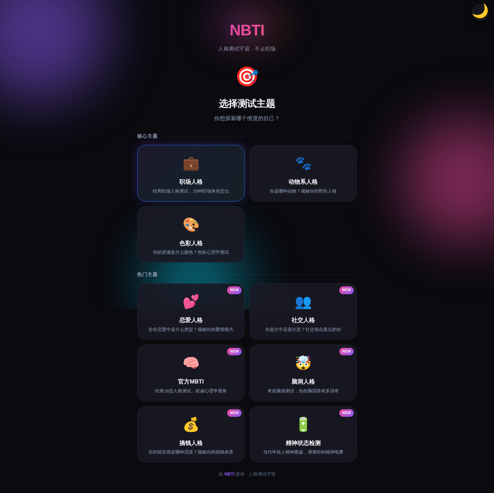
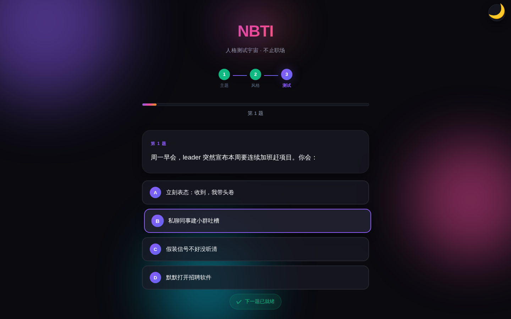
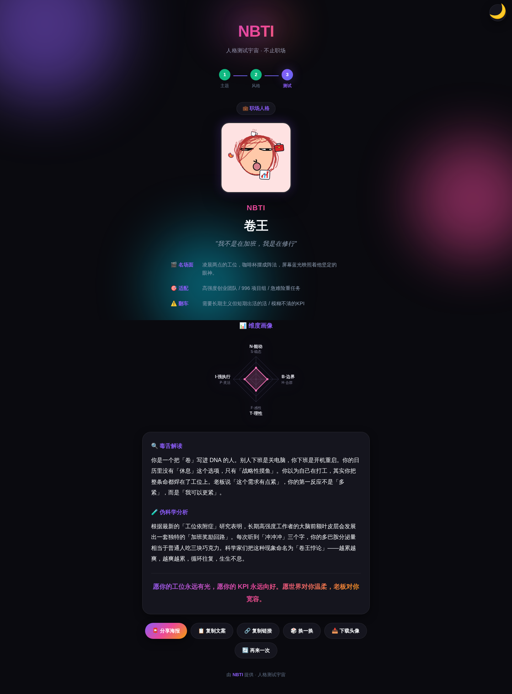
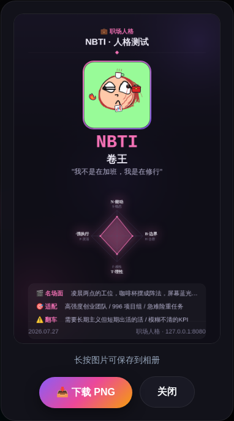
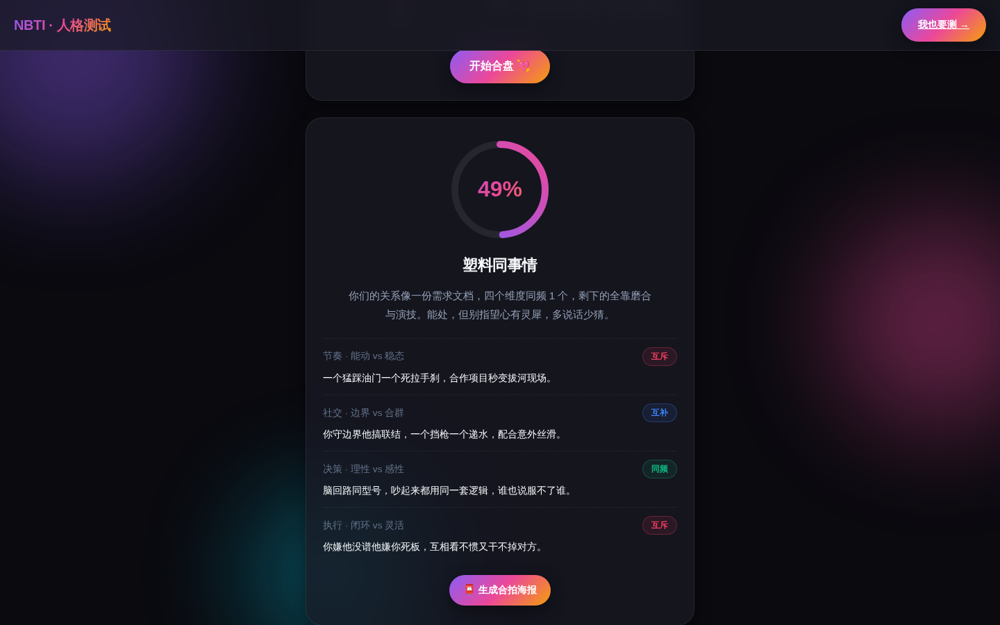
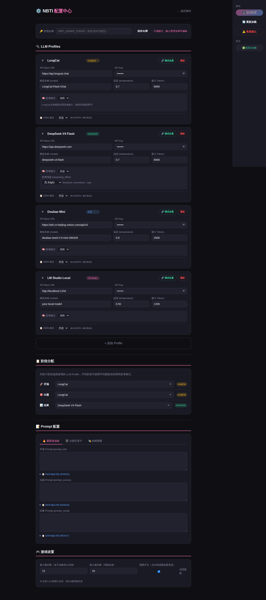

<p align="center">
  
  
  
  
  
  
  
  
  
  
  
  
</p>

<h1 align="center">
  NBTI · 牛比体 v4.0
  <br/>
  <sub>🎊 全民升级版 🎊</sub>
  <br/>
  <sub>专治各种不服 · 9大主题任你选</sub>
  <br/>
  <sub>Your Personality, Roasted by AI × 9 Themes</sub>
</h1>

<p align="center">
  <i>不是又一个山寨测试。这个有脾气，有9大主题，还有动物CP合盘。</i>
  <br/>
  <i>Not another personality test. This one has attitude. And 9 themes. And animal CP compatibility.</i>
</p>

<p align="center">
  <a href="#-9-大主题一键开测">9 大主题</a> ·
  <a href="#-快速开始">快速开始</a> ·
  <a href="#-精炼特性">特性</a> ·
  <a href="#-配置">配置</a> ·
  <a href="CONTRIBUTING.md">贡献</a> ·
  <a href="LICENSE">License</a>
</p>

---

## ✨ 9 大主题，一键开测



*3 大核心主题（💼 职场 / 🐾 动物 / 🎨 色彩）+ 6 大热门主题（💕 恋爱 / 👥 社交 / 🧠 MBTI / 🤯 脑洞 / 💰 搞钱 / 🔋 精神状态），随你挑。*

---

## 🤖 AI 即兴出题，越答越懂你



*每道题由 LLM 根据你前面的回答实时生成，支持 2-4 个选项智能匹配场景。下一题的 4 个分支答案已经预加载好了，秒级切题。*

---

## 📊 结果页：4 维雷达 + 毒舌锐评



*程序化生成的专属头像 + 4 维雷达图 + 名场面 / 适配 / 翻车 + 毒舌解读 / 伪科学分析 / 金句收尾。*

---

## 🖼️ 一键分享海报（朋友圈炫图神器）



*750×1200 Canvas 海报，主题配色自动适配，长按保存到相册。*

---

## 💞 动物/人格 CP 合盘



*两个人格代码进去，一个合拍指数 + CP 组合名 + 逐维度解读出来，支持跨主题计算，零 LLM 调用纯本地算。*

---

## ⚙️ 4 厂商 LLM 热插拔



*运行时在 LongCat / DeepSeek / Doubao / LM Studio 之间切换，不同阶段（开场/出题/结果）分配不同模型，连通性一键测试。*

---

## 🎯 精炼特性

- 🎯 **9 大测试主题** —— 职场 / 动物 / 色彩 / 恋爱 / 社交 / MBTI / 脑洞 / 搞钱 / 精神状态
- 🎭 **7 种吐槽风格 × 9 主题 = 63 玩法** —— 暴躁老油条、霸总、玄学、二次元、戏精闺蜜……
- 🤖 **真 AI** —— 不是 Excel 分支，每道题 LLM 即兴出题
- 🔌 **4 厂商 LLM 热插拔** —— LongCat / DeepSeek / Doubao / LM Studio 运行时切换
- ⚡ **SSE 流式 + 预加载** —— 下一题 4 个分支已生成，秒级切题
- 🎨 **137 种程序化 SVG 头像** —— 零图片素材，纯数学生成
- 🐾 **5 彩蛋人格** —— 薛定谔 / 六边形 / 活佛 / 双面人 / 嘴替
- 📊 **4 维雷达图** —— 主题配色 SVG 雷达
- 🖼️ **主题配色 Canvas 海报** —— 750×1200 一键分享
- 💞 **跨主题 CP 合盘** —— 两个人格码进，CP 审判结果出
- 📱 **PWA 可安装** —— 断点续测，进度写 localStorage
- ☁️ **Docker 一键部署** —— docker-compose up 完事

---

## 🚀 快速开始

### Docker（推荐）

```bash
git clone https://github.com/Gary23333/NBTI.git
cd NBTI
cp data/config.json.example data/config.json   # 填入你的 API Key
docker-compose up -d
open http://localhost:8080
```

### 手动启动

```bash
git clone https://github.com/Gary23333/NBTI.git
cd NBTI
pip install -r requirements.txt
cp data/config.json.example data/config.json   # 填入你的 API Key
python server.py             # 终端 1：后端 API（127.0.0.1:8081）
python frontend_server.py 8080  # 终端 2：前端代理（公网 8080）
open http://localhost:8080
```

---

## 🔧 配置

**环境变量**（覆盖 config.json）：

```bash
export NBTI_API_KEY_LONGCAT=your_key
export NBTI_API_KEY_DEEPSEEK_V4_FLASH=your_key
export NBTI_API_KEY_DOUBAO=your_key
export NBTI_ADMIN_TOKEN=your_admin_token   # config.html 写操作需要
```

**LLM Profiles** —— 每个 profile 是一组 vendor / endpoint / model / api_key / temperature / json_mode 配置，可按阶段（init / assess / result）分配不同模型。支持 4 厂商：

| Vendor | Example Model | 备注 |
|---|---|---|
| Doubao | doubao-seed-2-0-mini | 字节 / Volces Ark |
| DeepSeek | deepseek-v4-flash | 支持 thinking |
| LM Studio | google/gemma-4-e4b | 本地推理 |
| LongCat | LongCat-Flash-Chat | 内置 thinking |

**吐槽风格** —— 7 种人设运行时切换，详见 `nbti/prompts.py`。

---

## 🧱 技术栈

Python Flask + Vanilla JS + SVG + SSE + PWA，单仓单页，前后端双进程（API 密钥留在 127.0.0.1 后端，公网前端零密钥）。

完整架构 / 安全模型 / 项目结构见 [CONTRIBUTING.md](CONTRIBUTING.md)。

---

## 🤝 参与贡献

欢迎 PR！主题、prompt 预设、LLM 厂商、人格类型都可以扩展，详见 [CONTRIBUTING.md](CONTRIBUTING.md)。

更新日志见 [CHANGELOG.md](CHANGELOG.md)。

---

## 📄 License

MIT — see [LICENSE](LICENSE).

---

<p align="center">
  <b>🎊 NBTI · 牛比体 v4.0 · 全民升级版 · 你的人格，被 AI 毒舌了 🎊</b>
  <br/>
  <sub>Your personality. Roasted. In 9 ways.</sub>
</p>
